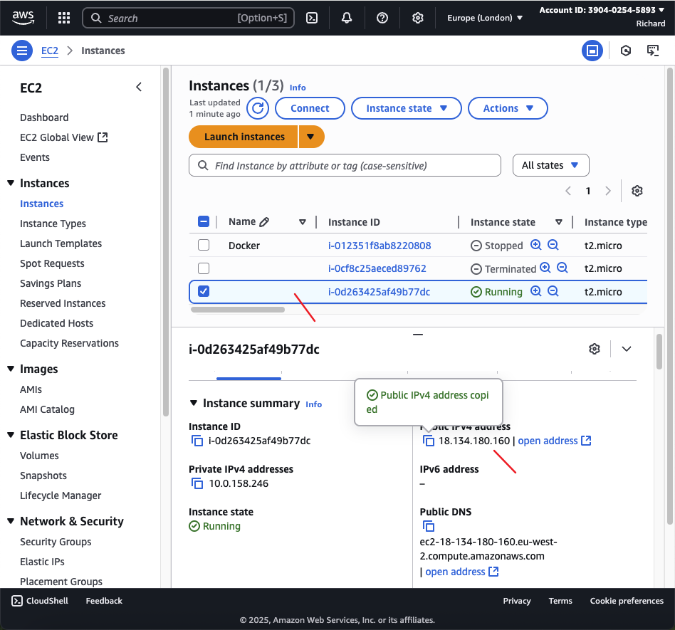

# terraform-ec2-keypair
Terraform EC2 Instance with key pair and user Data

Step 1 After creating my directory `terraform-ec2-keypair` and running through vsc 

# Step 2 adding my `main.tf file `

# Step 3 Apply the Configuration using `terraform apply`

# Step 4 
- This image shows Terraform configuration and the script added

# Step 5 AWS Console – Selecting an AMI
- This image shows the AWS Console where i selected an Amazon Machine Image (AMI) for my EC2 instance.

# Step 6  AWS Console – Finding my VPC and Subnet
- This step demonstrates how to find VPC ID and subnet ID in the AWS Console. These values are needed in your Terraform configuration to ensure your EC2 instance is launched in the correct network environment.

# Step 7 Verifying the EC2 Instance and Web Server
- This image shows how to verify that my EC2 instance is running and that the web server is accessible. 

## Project Summary
This project demonstrates how to use Terraform to automate the provisioning of an AWS EC2 instance with secure access and automated configuration. The workflow includes generating or using an SSH key pair, creating a security group to allow HTTP access, and launching an EC2 instance with a user data script that installs and starts a web server. The project guides you through best practices for infrastructure as code, including resource management, security, and verification of the deployed environment.